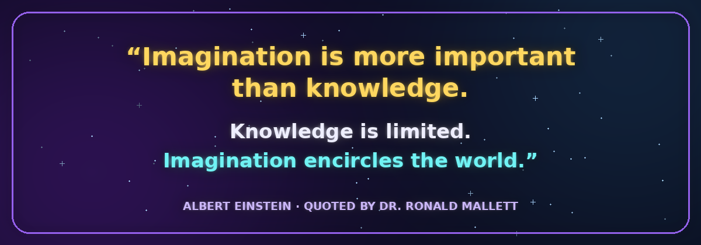
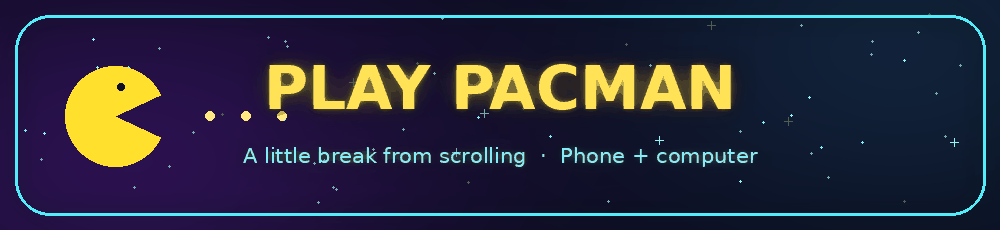
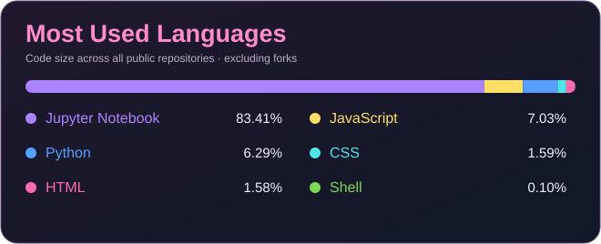

  

<b>I like figuring out how things work, building useful projects and trying something new.</b>

<i>Usually thinking about a project, space, or what to bake next.</i> 🪐

  
  

  

A quote that always motivates me.

## 👩🏽‍💻 A little about me

I'm interested in different areas of tech, from building applications to investigating digital evidence and understanding IT risks. I like projects where I can try things out and see the result.

One of my first practical tools came from my part time job. I wanted a quicker way to check which products were excluded from a promotion, so I made a **product ID checker** instead of searching through the paperwork every time.

Outside tech, I love **space, LEGO, baking and writing**. I also like the occasional game, which is how PacMan ended up here. 👻

## 🌈 There’s a lot I want to explore

<h2></h2>

<h3 align="center">
  You must be bored of reading my bio by now… 
  take a break and try the game I built! 👀
</h3>

<h3 align="center">
  🎤 Introducing the one, the only… 
  THEEEEE PACMAN!! 👻🟡
</h3>

  <i>A classic that never gets old. Go on, one game won’t hurt…</i>

  

  <a href="https://Arica24.github.io/PacMan/"><b>▶ Play in your browser</b></a>
  ·
  <a href="https://github.com/Arica24/PacMan">View the code</a>

  
## 💻 My growing toolkit

*Languages and tools I've used or am developing my skills in through projects and labs.*

### Languages

### Web & development

### Forensics & security tools

### Systems & practice

## 🛠️ Things I've built

| Project | Why I made it |
| --- | --- |
| [👟 VM-Fixture (In progress..🔄)](https://github.com/Arica24/VM-fixture) | To organise visual merchandising fixtures and product displays at my part time job. |
| [🟡 Yellow Dot Promo Checker](https://github.com/Arica24/Yellow-dot-Promochecker) | To check promotion exclusions by product ID at my part time job. Less paperwork, quicker answers. |
| [🔐 Private Notes App](https://github.com/Arica24/Private-notes-App) | To practise building a web app with login and private notes. |
| [🔎 Security Log Analyser](https://github.com/Arica24/Security-log-analyser) | To find useful information in security logs. |
| [🧮 Cryptography Labs](https://github.com/Arica24/Python-cryptography-lab) | To understand ciphers, encryption and decryption by writing code. |
| [📊 Loan Approval Prediction](https://github.com/Arica24/loan-approval-prediction) | To explore how data can be used to make predictions. |
| [👻 PacMan](https://github.com/Arica24/PacMan) | To make something people can open, play and enjoy. |

## 🔭 What I'm up to

- **Working on:** making my web projects and browser game easier to use.
- **Learning:** more JavaScript, Node.js and C++, plus how to test my applications properly.
- **Open to collaborating on:** small web apps, practical tools and games.
- **Could use a hand with:** cleaner code and good testing habits.
- **Ask me about:** my projects, space, LEGO or what I'm baking.
- **Reach me:** [LinkedIn](https://www.linkedin.com/in/arica-bhuiyan-7ab801272/).
- **Fun fact:** one of my projects started because I was tired of searching through paperwork at work.

## ✨ GitHub activity

  
  

  

  <b>Thanks for stopping by!</b> ⭐ 
  If you came for the code and stayed for PacMan, fair enough.

